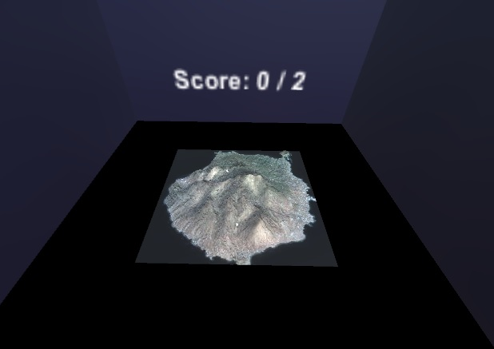

# unity-oculus-gear

## About

This is a toy project for testing [Unity 3d](https://unity3d.com) development for [Samsung Gear VR](https://www.oculus.com/en-us/gear-vr/).

## Instructions

**NOTE: this project is aimed to Windows and Unity 3d version 5.2.1 or greater**

1. Prepare your development environment following the instructions on the next link: [Android Development Software Setup for Windows](https://developer.oculus.com/documentation/mobilesdk/latest/concepts/mobile-dev-setup-android-win/). **NOTE:** in my particular case I don't use Eclipe, so I didn't configure it.
2. Clone this repo locally. From now on, we will refer to the local copy of the repo as *REPO_DIR*.
3. Generate an Oculus Signature file (osig) for your mobile following the instructions on [this link](https://developer.oculus.com/osig/).
4. Open *REPO_DIR*/UnityProject with Unity 3D.
5. Plug your Samsung to the computer.
6. On Unity, open the scene in *Assets/Scenes/SampleScene.unity* and set Android as the target platform.
7. Build the Unity project and enjoy!.
